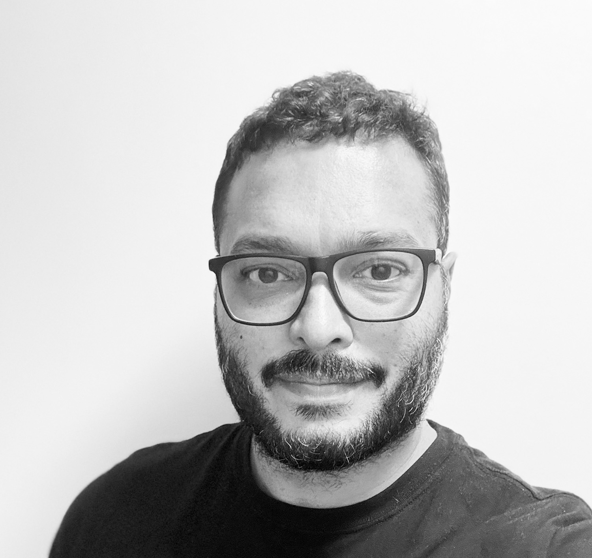

# Nascimento Rodrigo - Portfolio - Section B

**Objective:** Creation of a website to show my design work, both from the Interactive Media Design course and for real clients. This project helped me enhance my skills in UX/UI, Graphic Design, Motion Design, Front-end programming (JavaScript, HTML, CSS, SASS, and tools like Greensock), and Back-end development (PHP and MySQL).

## Installation
No installation required

## Technology Used
1. Pen and Pencil
2. Figma
3. HTML + CSS (Sass) + Java Script (Green Socks)
4. PHP + My SQL

## History
October 2024

## Special thanks
To my family who supported me in this dream adventure and to my professors specially Jarrod, Rob and Joe

